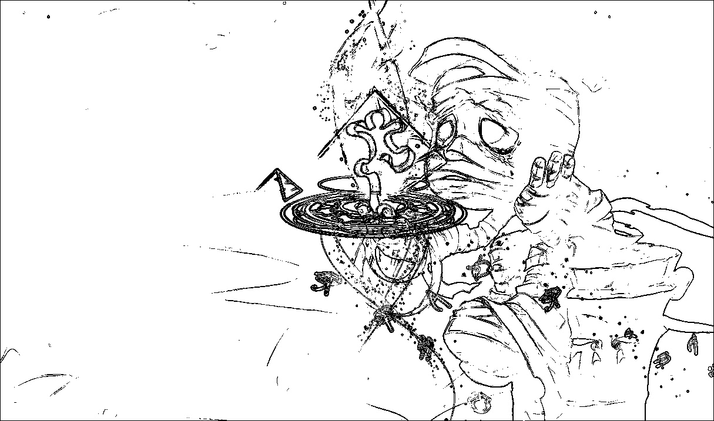

# HOG Algorithm Implementation

## Description
HOG (Histograms of Oriented Gradients) Algorithm is an algorithm aiming to realize **object segmentation** (edge detection) on images before CNN models are widely used. 

## Reference
Navneet Dalal and Bill Triggs, [Histograms of Oriented Gradients](https://lear.inrialpes.fr/people/triggs/pubs/Dalal-cvpr05.pdf), *CVPR 2005*

## Getting Started
1. Clone this repository
```
git clone https://github.com/LeoTheBestCoder/HOG_implementation.git
```

2. Install related libraries
```
pip install opencv-python
pip install numpy
pip install matplotlib
```

3. Put your input image under same directory and modify [**line 10**](https://github.com/LeoTheBestCoder/HOG_implementation/blob/b33e8bdb7e9c07d361f420eb00dade209c5dec53/image.py#L10) in **image.py** (include filename extension)
``` python
IMAGE_NAME = 'amumu.jpg'
```

4. Run the script
```
python3 image.py
```


## Demostration
* Input Image

* Segmentation Result
